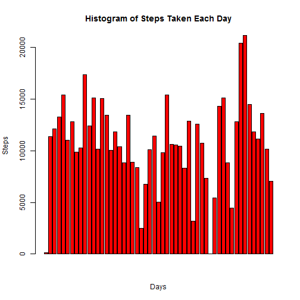
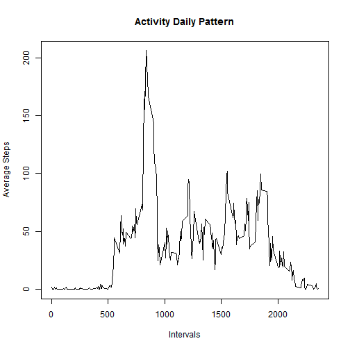
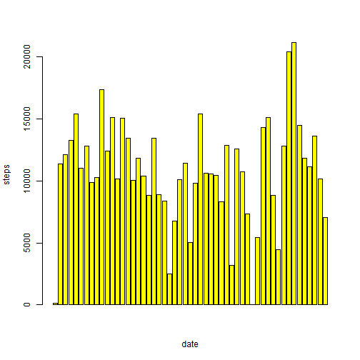
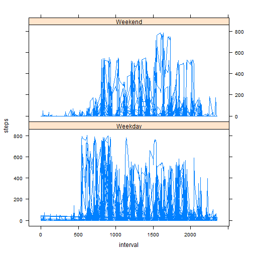

# Reproducible Research: Peer Assessment 1
## Loading and Preprocessing Data

```r
y <- read.csv("activity.csv", header = T, colClasses = c("numeric", "Date", 
    "numeric"))
good <- complete.cases(y)
x <- y[good, ]
```

## What is mean total number of steps taken per day?
### Part1

```r
xx <- aggregate(steps ~ date, data = x, FUN = sum)
barplot(xx$steps, col = "Red", main = "Histogram of Steps Taken Each Day", xlab = "Days", 
    ylab = "Steps")
```

 

### Part2

```r
xx <- aggregate(steps ~ date, data = x, FUN = sum)
mymean <- mean(xx$steps)
mymedian <- median(xx$steps)
```

The mean and median total number of steps are 1.0766 &times; 10<sup>4</sup> and 1.0765 &times; 10<sup>4</sup> respectively.

## What is the average daily activity pattern?
### Part 1

```r
library(sqldf)
```

```
## Loading required package: gsubfn
## Loading required package: proto
## Loading required package: RSQLite
## Loading required package: DBI
## Loading required package: RSQLite.extfuns
```

```r
z <- sqldf("select interval,date, avg(steps) as steps from x group by interval")
```

```
## Loading required package: tcltk
```

```r
plot(z$interval, z$steps, type = "l", xlab = "Intervals", ylab = "Average Steps", 
    main = "Activity Daily Pattern")
```

 

### Part 2

```r
xxx <- aggregate(steps ~ interval, data = x, FUN = sum)
xxx$interval[which.max(xxx$steps)]
```

```
## [1] 835
```


## Imputing missing values
### Part 1

```r
sum(is.na(y))
```

```
## [1] 2304
```

### Part 2
As suggested, I will use mean for that 5 day interval. Below's the code.

### Part 3

```r
x2 <- aggregate(steps ~ interval, data = y, FUN = sum)
y <- merge(y, x2, by = "interval", suffixes = c("", ".New"))
emptyval <- is.na(x2$steps)
y$steps[emptyval] <- y$steps.New[emptyval]
y <- y[, c(2, 3, 1)]
```

### Part 4

```r
xxx <- aggregate(steps ~ date, data = y, FUN = sum)
barplot(xxx$steps, xlab = "date", ylab = "steps", col = "Yellow")
```

 

```r
mymean1 <- mean(xxx$steps)
mymedian1 <- median(xxx$steps)
```


The mean and median total number of steps are 1.0766 &times; 10<sup>4</sup> and 1.0765 &times; 10<sup>4</sup> respectively.It doesn't really differ and there wasn't much of an impact. The two histogram looks similar. 

## Are there differences in activity patterns between weekdays and weekends?
### Part 1

```r

myday <- function(date) {
    if (weekdays(as.Date(date)) %in% c("Saturday", "Sunday")) {
        "Weekend"
    } else {
        "Weekday"
    }
}
qq <- sapply(x$date, myday)
x$Day <- as.factor(qq)
head(x)
```

```
##     steps       date interval     Day
## 289     0 2012-10-02        0 Weekday
## 290     0 2012-10-02        5 Weekday
## 291     0 2012-10-02       10 Weekday
## 292     0 2012-10-02       15 Weekday
## 293     0 2012-10-02       20 Weekday
## 294     0 2012-10-02       25 Weekday
```

### Part 2

```r
library(lattice)
z <- sqldf("select interval,date, avg(steps),Day as steps from x group by interval")
```

```
## Warning: NAs introduced by coercion
```

```r
xyplot(steps ~ interval | Day, data = x, layout = c(1, 2), type = "l")
```

 


